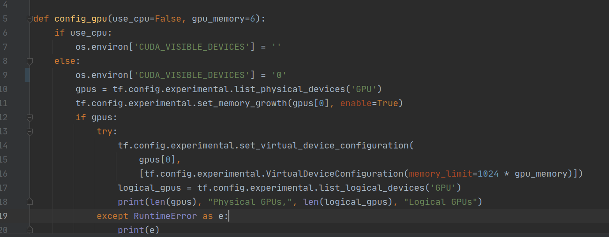
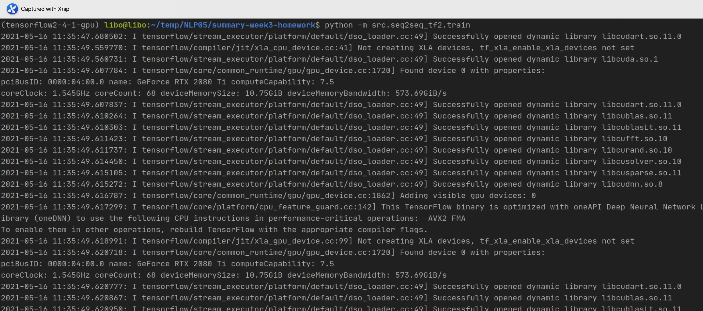
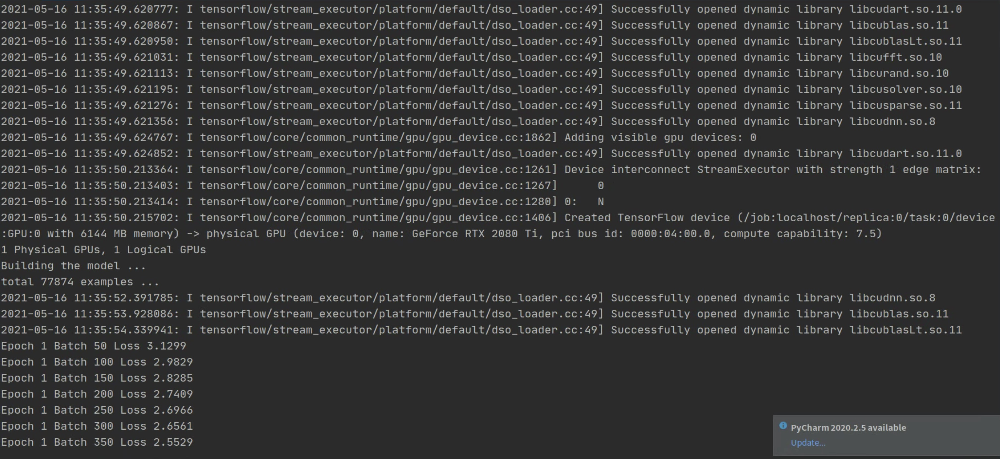
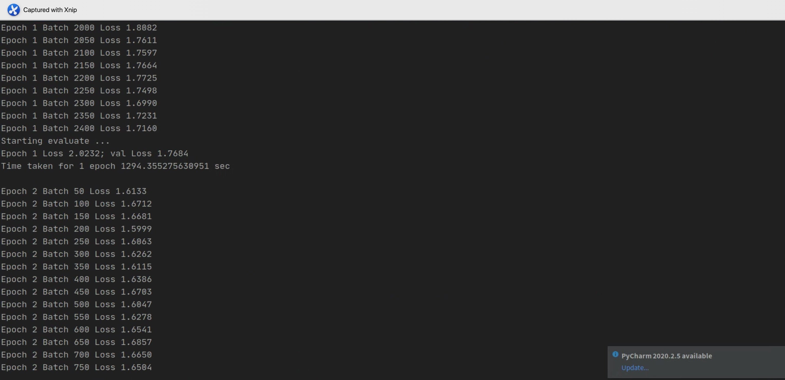
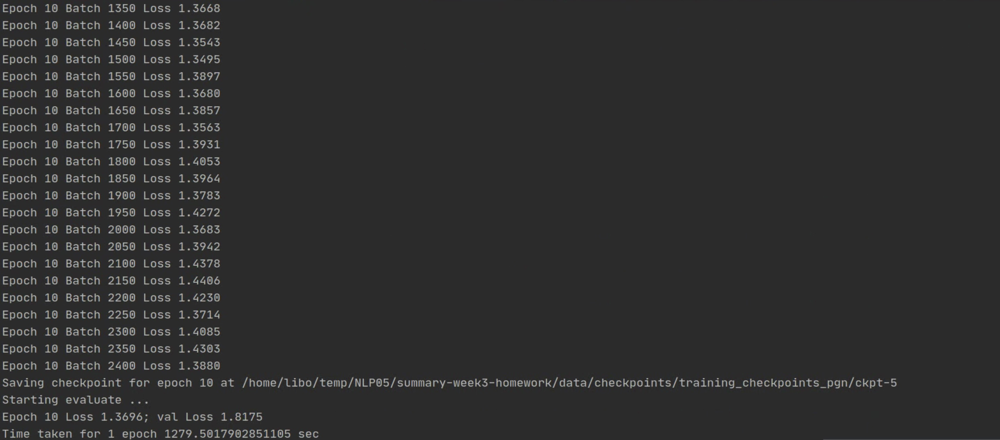
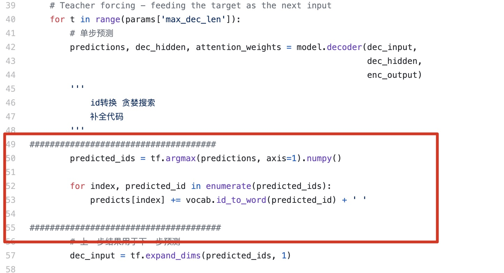
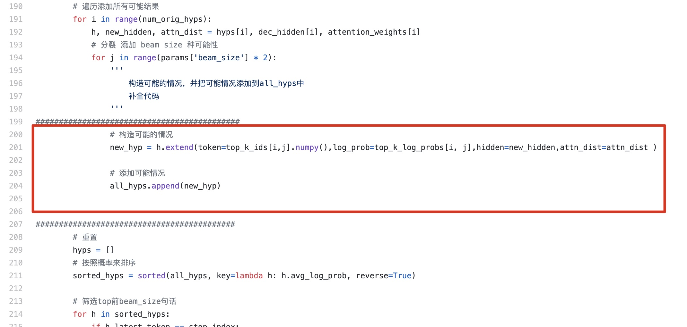
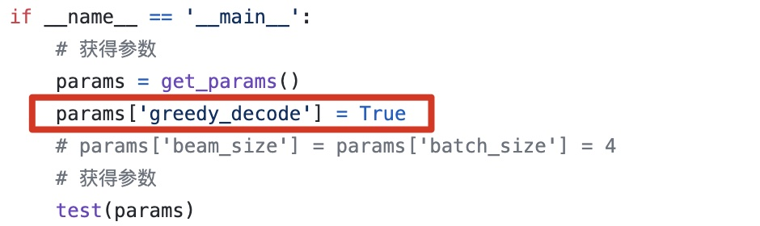
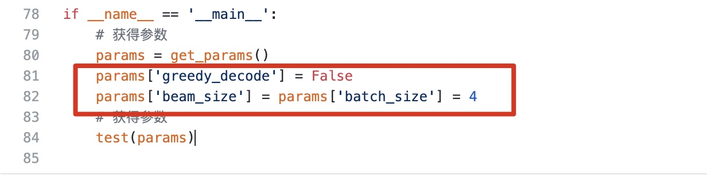

### Homework-week3

+ 参考模型和训练代码，继续完成week2的作业，保证可以训练seq2seq模型

    + 在训练过程中出现找不到load_dataset.py的问题，通过在build_data文件夹中找到了load_dataset函数，需要在seq2seq_tf2中的seq2seq_batcher.py中加入from src.build_data.utils import load_dataset

    + 在src/utils/gpu_utils.py中需要尤其考虑的是我们设置GPU的参数设置，我觉得老师的GPU应该是多个的，所以他在设置中选择了第二个GPU，参数为"1"，对于向我们这样的学生而言，一般只有1个GPU，因此需要在设置中选择第一个GPU，参数设置为"0"，具体如下图所示：

        

    + 经过以上的参数调整之后，就可以进行训练了，训练过程如下：

        

        

        

        

经过10轮epoch训练过程之后，loss结果从3.130到

+ 补全predict_helper.py中函数batch_greedy_decode的greedy search代码如下：

    

+ 补全predict_helper.py中函数beam_decode中的代码

    

+ 通过调整predict.py中的参数，使用gready search和beam search做预测

    + 我们在predict的main方法中设置params[beam_code]=True，那么就会调用greedy search方法进行预测，如下图红色方框所示。

    

    + 我们在predict的main方法中设置params[beam_code]=False，设置params['beam_size'] = params['batch_size'] = 4，那么就会调用beam search方法进行预测，其中的beam_size的大小参数和batch_size参数均为4，也可以调整为其他的参数值。

    